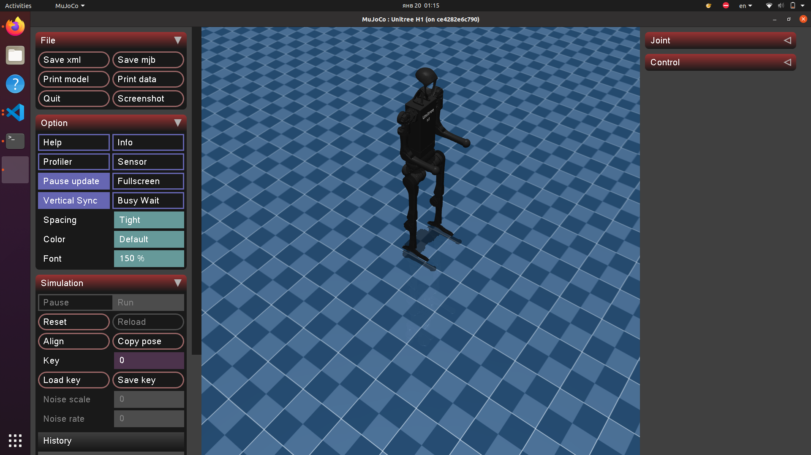

Hello from Unitree sim


# Related links
- [unitree_mujoco](https://github.com/unitreerobotics/unitree_mujoco)
- [unitree_sdk2](https://github.com/unitreerobotics/unitree_sdk2)
- [unitree_sdk2_python](https://github.com/unitreerobotics/unitree_sdk2_python)
- [unitree_ros2](https://github.com/unitreerobotics/unitree_ros2)
- [Unitree Doc](https://support.unitree.com/home/zh/developer)
- [Mujoco Doc](https://mujoco.readthedocs.io/en/stable/overview.html)

# Installation
## 1. Dependencies
Please clone this repo to your machine:
```bash
git clone git@github.com:Fatyhich/unitree_sim.git
```

Repo contains Docker configuration with all required dependencies. To work with the project:

```bash
cd unitree_sim
xhost +  # Enable X11 forwarding
docker compose -f 'compose.yaml' up -d --build 'develop' 
```

This command will:
1. Build the Docker image with all dependencies
2. Create and start a container with proper X11 forwarding and volume mounting
3. Execute the startup script and provide you with an interactive shell

**Important Note**: The compose file is configured to mount `/home/mrob1/Projects` to `/home/oversir/humanoid_sim` in the container. You **may need** to adjust the volume paths in `compose.yaml` according to your system setup. And also please adjust your **hostname** and **GID/UID**.

## 2. Starting Simulator
Once inside the container, to run the simulator with our robot:
```bash
sudo apt-get update & upgrade -y
cd humanoid_sim/unitree_mujoco/simulate_python 
python3 ./unitree_mujoco.py
```
As a marker of success, you will see a new window with the simulator and robot appear! 